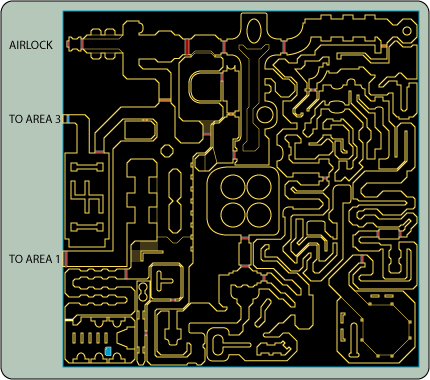

Title: Welcome to the DynaMars Corporation's Ares Station Update Service (5)
Date: 2005-12-28T00:00:00.0+00:00
Modified: 2005-12-28T00:00:00.0+00:00
Section: dynamars
Slug: dynamars-update-005
Authors: DynaMars Corporation Information Kiosk
Summary: Keep up to date on the DynaMars Corporation's perpetually doomed efforts to colonize Mars.

%%%

# Station News

Welcome to the Ares Station Update Service. This appears to be your first visit to an information kiosk. Previous updates are available in archived format!

This kiosk is designed to keep you up-to-date on the latest developments pertinent to residents of the DynaMars Corporation's Ares Station, the premiere living and research colony on Mars.

Please read each update in full.

**01-14-2304 - New Entry**

They said it could not be done, but here we are, back in the brand new Ares Station! The DynaMars Corporation wishes to thank you for your support and interest in the newly renovated and restored Ares Station. We are aware that Ares Station has a checkered past as far as safety goes, but the DynaMars Corporation's new CEO Tom Davies is committed to making it a functional, safe, and pleasant working environment. He knows how important this is firsthand, having served on Ares Station in the past. His decision to reopen the dormant facility shows bold vision, a skill required in building bridges to the future!

CEO Davies said this in a DynaMars Corporation press release:

It has been a long road to travel in reopening Ares Station. My experience as a resident of that beleaguered outpost will haunt me forever, but I have recovered and stuck with the DynaMars Corporation, as it has stuck with me in my darkest hour. Today is a chance to right the wrongs of the past, and to finally let Ares Station live up to its true potential. Ares Station is going to be what it was intended to be all along: a beacon of light in the darkness of space.

There are many new safety regulations and changes in place to protect you and your fellow personnel. For starters, we have demolished several areas of the base and completely remodeled the rest. The new Ares Station is 100% more safe, efficient, and easy to navigate. The mistakes of the past will not be repeated.
There are currently 6 areas open and operational. Please refer to the map section of the kiosk or your personal PDA for more information on the new Ares Station.

**01-15-2304 - New Entry**

Ares Station Commanding Officer Paskiewicz is pleased with the first day of operations. He is thankful to all personnel for acting professionally and is glad everyone is settling in so nicely.

In 4 days time the members of the new Quantum Labs Science Team will be arriving in the Area 1 Landing Port. They will be working in the state-of-the-art Area 5 Quantum Laboratories, where they will be researching methods of diminishing cane toad populations on Earth, which, as data collected in 2300 shows, now occupy 47% of the planet's surface, making them a grave threat to the survival of mankind.

Chief Science Officer Thorpe will be responsible in leading the fight to save Earth, and has DynaMars Corporation's full support.

**01-16-2304 - New Entry**

We have received distressing reports that a number of personnel are stuck in Area 2, unable to find their way out. Chief Security Officer Wade has been dispatched to locate the lost crewmen and lead them to safety.

**01-17-2304 - New Entry**

We have learned that Chief Security Officer Wade is lost, however he and all the missing personnel are able to access a kiosk. Here is a map showing the current location of the blue keycard required to exit Area 2 and proceed to Area 3.

**01-18-2304 - New Entry**

DynaMars Corporation would like to apologize to the missing personnel for delaying their safe return. We regretfully forgot to include the location of the yellow keycard required to open the door to access the blue keycard. Here is an updated map showing the current location of the yellow keycard required to open the door leading to the area containing the blue keycard. For energy saving purposes, Area 2 Ventilation Control is only lit 50% of the time. Thusly, every other second the lights go out. This "strobe effect" might seem disorienting, but it cuts down on power consumption by 50%.

Please be advised that 2 Mobile Defense Sentry Units (MDSUs) are active in Area 2 and currently malfunctioning. Chief Engineer Shmorkison is working on a fix for that problem. He believes their optical sensors might be overloaded, thus causing them to fire at random. Residents are advised to use caution and common sense.

**01-19-2304 - New Entry**

Early this morning, the Quantum Labs Science Team arrived safely in the Area 1 Landing Port. Chief Science Officer Thorpe issued this brief statement:

I have just come from a war torn planet. I am part of a species on the verge of annihilation. Cane toads have conquered every continent, every predator, and every obstacle. They have chased us to the depths of space, separating us from family and homeland. Here on Mars we make our stand. My fellow scientists and I will find a way to turn the tides of war, and return the land to its rightful owner: mankind. These toads are adept at many things, but we alone control the frontiers of science. In the end, that is what makes us a worthy victor.

Chief Science Officer Thorpe brings with him 1,000 cane toad specimens for research purposes. Personnel are not to go anywhere near the Area 5 Test Chambers where the toads are kept. Armed guards will shoot on sight.
Most of the lost Area 2 personnel made it to Area 3 late last night. Unfortunately there were two fatalities. Chief Engineer Shmorkison was able to deactivate the MDSUs by turning off all the lights in Area 2. Sadly, the lack of light caused two well-liked members of the Ares Station family to unknowingly walk into active Area 2 Ventilation Control Air Purification Processors. The two personnel were killed instantly and transformed into breathable oxygen for the rest of the base. DynaMars Corporation wishes to thank them for their service and reminds all personnel that a small part of our fallen comrades lives on in each of us.

**01-23-2304 - New Entry**

The DynaMars Corporation is pleased to announce that Ares Station is improving! The brand new Area 7 is now open! This exciting new center will serve as the Red Planet's first senior citizen living community. The center is paid for and financed by the Milky Way Amalgam Tranplanetary Banking Corporation, as part of their settlement with the Lunar Exchange Commission. Ares Station will soon host 100 senior citizens in a robust, safe, and engaging environment. Because of the sensitive nature of the work conducted on Ares Station, Area 7 residents will not be able to access the rest of the station without authorized escort.

Good news! In an effort to make Ares Station more accessible to the public, DynaMars Corporation is renting out the Area 1 Cargo Bay and Area 3 Conference Room to the Interstellar Boat and Fishing Federation for the 51st annual Interstellar Boat and Fishing Expo, to be held on 02-20-2304. Residents of Ares Station are invited to attend at reduced admission prices.

Area 7 Residents are expected to begin arriving in 2 days time.

**01-25-2304 - New Entry**

Chief Science Officer Thorpe is asking personnel to assist him in locating 3 cane toads that went missing from Area 5 Storage Unit 47. The toads are valuable specimens that have been injected with an experimental serum designed to render them inert.

Chief Commanding Officer Paskiewicz is offering a 400 credit reward for the safe capture of the missing toads. The DynaMars Corporation wishes to remind residents that these toads are mankind's greatest threat, and should not be given shelter even if they appear harmless.

Senior citizens have been arriving all day in the Area 1 Landing Port. Chief Security Officer Wade has been working overtime to get them safely to Area 7, where they will reside for the rest of their lives.

**01-27-2304 - New Entry**

By now you've all heard the tragic news that the Phobos Mining Corporation had to shut down operations due to a severe asteroid impact. The Interstellar Emergency Management Agency has asked Ares Station to provide temporary shelter for refugees. We have agreed, and are making room for 120 miners in the Area 7 Senior Center.

DynaMars Corporation would like to remind all Ares Station personnel that even though these men are gruff and uncivilized, they are people and deserve respect. Please treat them like members of the Ares Station family, although we recommend you do not touch them.

In order to accommodate the increased volume, we are setting up a temporary Senior Center in the Area 1 Cargo Bay and moving all the seniors there. Cargo will temporarily be stored outside under a tarp.

In yet more tragic news, the 3 missing cane toads have been recovered, though dead. The experimental serum had caused them to grow to roughly the size of a human being, making them an extreme threat to personnel. Several crewmembers were killed when the toads attempted amplexus with them. Chief Security Officer Wade and his men were able to kill the beasts with standard ordinance, causing minimal damage to the integrity of Ares Station.

Unfortunately, Chief Science Officer Thorpe believes that one of the toads was pregnant and that it may have given birth while out of captivity. The hunt continues.

**02-02-2304 - New Entry**

Chief Security Officer Wade believes he has accounted for all the fugitive cane toad babies. He and his men have killed over 18,000 tadpoles in the Area 6 Sewage Corridors. Adjunct Sanitation Engineer Burroughs has been assisting in draining each sewage corridor to help in the process. This is why the restrooms have been going offline recently. This is also why security guards are posted in each restroom to assure no cane toads escape from out of the toilets. We understand your need for privacy, but the fate of mankind outweighs this need.

The first wave of refugees from Phobos has arrived and they are being assigned accommodations in the Area 7 Senior Center. There have been some incidents of violence but overall these salty men are being respectful and courteous. We are working the air purification systems overtime to try to minimize any unpleasant odors.

The Area 1 Cargo Bay is proving to be a tenuous shelter for our elderly residents. Because we are not able to isolate the individual factions as well as we were in the Area 7 Senior Center, gang violence is erupting. We have added increased security personnel to deal with the troubles. We have also been forced to relocate many seniors suffering from dementia to temporary quarters in the Area 4 Main Central Control Auxiliary Conference Room, where they can no longer smear obscenities into the walls with bodily secretions, unless they do that there. We have asked them not to and they have agreed.

**02-06-2304 - New Entry**

DynaMars Corporation CEO Davies is returning to Ares Station to personally inspect and evaluate the performance of the base and its personnel. Residents of Ares Station are expected to be on their best behavior, and to also have the base looking clean and orderly. CEO Davies will be arriving in 4 days time aboard his personal transport ship the USS Snettim.

Several residents have sighted cane toads exhibiting numerous unnatural adaptations, including laser skin, intangibility, and a capacity for advanced problem solving. A handful of residents have checked into the Area 5 Infirmary claiming that they even had cane toads living inside them. Although Ares Station doctors have verified one case of microscopic cane toads colonizing a human host, the other patients were clearly imagining things.

DynaMars Corporation wishes to remind Ares Station residents that things are fine and operations are running smoothly. Chief Science Officer Thorpe remains optimistic, believing this situation to be fully under control. Thorpe is confident a means to fight the cane toads and potential new super cane toads will be developed within the next few days by the dedicated crew of Quantum Labs.

Refugees living in Area 7 have reported no problems and are behaving nicely. As a safety precaution, we are pumping less oxygen into Area 7 to calm the refugees and minimize the risk of violence.

**02-10-2304 - New Entry**

Chief Science Officer Thorpe has announced that a new method for dealing with cane toads has been perfected!

Quantum Labs is pleased to announce that the tides of war are about to turn. We have created an airborne virus that infects only cane toads and poses no threat to human beings. This virus causes the typical cane toad to burst when performing amplexus. Literally, the genitals swell up and explode, triggering a violent chain reaction that ripples throughout the entire body. Each one will just explode, blood and guts everywhere. We did experiments on mice and it worked like a charm every single time.

Perfect timing, Professor Thorpe! DynaMars Corporation is thrilled to once again be at the forefront of science, delivering monumental breakthroughs that change human life for the better.
DynaMars Corporation CEO Davies has returned to Ares Station for the first time in years. Even though he was nearly stabbed with a makeshift knife by a gang of senior citizens, he is upbeat and glad to be back in the station that defined a good part of his life. He has already inspected much of Area 1 and Area 2, and is pleased with the situation.

We regret to inform you that the refugees sheltered in Area 7 are all dead of oxygen deprivation. This is an unfortunate occurrence and CEO Davies promises a full investigation into how this freak accident occurred. The Interstellar Emergency Management Agency is insisting that someone be held accountable. The DynaMars Corporation would like to assure IEMA that if somebody is indeed responsible for this disaster, they will be reprimanded. In the meantime we are complying with IEMA requests that Area 7 not be disturbed, as it is a crime scene.

All personnel will be required to attend a meeting in the Area 3 Conference Hall at 1300 hours tomorrow.

**02-11-2304 - New Entry**

The DynaMars Corporation wishes to congratulate Ares Station on its continued success! Ares Station received accolades from CEO Davies at the conference for its outstanding performance and grace under pressure. There were some bumps in the road when cane toads attempted to assassinate him, but Chief Security Officer Wade and his men subdued them.

Chief Science Officer Thorpe promised that his virus would be ready for release in 3 days. In the meantime, CEO Davies and DynaMars Corporation wish to ask Ares Station residents to remain strong and vigilant. Salvation is on the way.

Violence erupted in the Area 1 Cargo Bay as hatred amongst rival senior citizen gangs intensified. Security personnel were unable to put a stop to the bloodshed due to the increased threat of cane toads. Early reports indicate that at least 30 seniors were killed in the brouhaha. We are temporarily storing bodies outside the Area 1 Cargo Bay under some tarps.

**02-14-2304 - New Entry**

Ares Station Commanding Officer Paskiewicz is asking anybody who knows the whereabouts of CEO Davies to please contact him immediately. Davies disappeared in the night and is believed to have been taken by a tribe of cane toads exhibiting amazing skills in the areas of group coordination and problem solving.

The toad problem has intensified, forcing rival senior citizen gangs to ally in order to fend off incursions into the Area 1 Cargo Bay. The DynaMars Corporation is pleased to see these seniors working together in harmony for a common goal. We are also pleased that they honored our request to keep the fighting to the southeast corner of the Area 1 Cargo Bay, allowing organizers to set up for the 51st annual Interstellar Boat and Fishing Expo.

This evening will see the release of Chief Science Officer Thorpe's toad virus into Ares Station's ventilation system. With any luck, all the toads will mate themselves to death by morning.

**02-15-2304 - New Entry**

There has been some success with the virus, as residents are reporting the remnants of toads splattered on walls, floors, and ceilings. However, there are still many toads alive, and they are continuing to evolve. Chief Science Officer Thorpe is confident the virus will continue to work and that the cane toad population will be dead within days.

Some residents have reported sightings of a hippopotamus in the Area 6 Sewage Corridors. DynaMars Corporation wishes to remind residents that the hippopotamus population on Mars was wiped out years ago. We understand that the situation has been stressful as of late, but this is no time for hallucinations.

Personnel working in Area 4 have reported that the cane toad population has mastered pottery and are quickly advancing in skill. Some are reported to be utilizing three-part harmonies for more sophisticated mating calls. Residents are advised not to disrupt these vocal displays, as mating calls should not be interrupted. The more they mate, the more they die.

The battle for the Area 1 Cargo Bay continues to escalate. Violence has spread from the southeast corner to the southwest corner, making it difficult for organizers to set up booths and exhibits for the 51st annual Interstellar Boat and Fishing Expo. Cane toads are proving to be the main culprit, eating and fatally mating with fish brought in for the show.

**02-17-2304 - New Entry**

CEO Davies has yet to be seen since disappearing, and the worst is feared. Ares Station Commanding Officer Paskiewicz has called off the search for him and is now dedicating all security personnel to extermination duty in an effort to assure the expo goes down without any trouble.

In yet more disturbing news, cane toads have taken over Area 7 and are showing amazing resourcefulness. The toads have somehow reactivated all systems in the area, and normalized oxygen flow. Life support sensors inside the Area 4 Main Central Control report unusual readings for Area 7, suggesting the presence of several large "super toads" at least 8 times the size of a human. It is theorized by Chief Science Officer Thorpe that these super toads are controlling the other toads through advanced telepathy.

Ares Station Commanding Officer Paskiewicz has requested immediate military support to aid in combating the super toads. IEMA has agreed to dispatch a military unit from Phobos to assist on the grounds they are allowed to investigate the deaths of the refugees.

Four more sightings of a hippopotamus have been reported. Area 4 Main Central Control reports no hippopotamus life signs. These are most likely evolved cane toads and not hippos.

**02-20-2304 - New Entry**

The DynaMars Corporation wishes to apologize to everyone for the tragic events that took place today. Although the day started out nicely, with senior citizens and cane toads keeping their battle to the southern portion of the Area 1 Cargo Bay, violence eventually spread to the northern portion where the 51st annual Interstellar Boat and Fishing Expo was taking place. The expo's sold out crowd was caught in the midst of a brutal battle between the elderly and an army of toads. Thankfully, the expo crowd sided with the seniors and fought a bloody battle against the toads.

They would likely have succeeded if not for the actions of the super toads, which used the opportunity to launch an attack. Somehow they were able to teleport into the cargo bay, bypassing the rest of the station entirely. They proved to be a terrifying enemy, as they demonstrated advanced telekinetic powers, which made it impossible for anyone to attack. They deflected bullets and people alike with ease.

When all hope seemed lost, CEO Davies resurfaced to help battle the toad population. Riding on the back of a visibly undead hippopotamus, presumably his old ally Professor Mittens, he led the humans into valiant battle against the super toads. Unfortunately, nothing they tried could stop the beasts, safely protected behind psychokinetic shields.

Even the IEMA Marines, arriving shortly after CEO Davies, were unable to stop the toads.

Eventually Ares Station Commanding Officer Paskiewicz was forced to open the Area 1 Cargo Bay Airlock in a desperate attempt to kill the super toads. This ended up killing everyone attending the expo as well as the seniors. Twelve IEMA Marines, CEO Davies, and several Ares Station Security Personnel died in the incident as well.

The cane toads, however, were not phased by exposure to the harsh Martian atmosphere. They merely closed the airlock doors via telekinesis and congregated close to one another in some sort of silent telepathic ritual. Three hours later all the cane toads disintegrated into pure light and dissolved into the air.

Chief Science Officer Thorpe theorizes that because the cane toads could no longer mate without exploding, they turned their focus to greater pursuits and used their advanced minds to ascend to a higher plane of existence, leaving behind the toils of mortality forever.

The DynaMars Corporation sends its deepest regards to the families of those that died on this tragic day. We are extremely displeased by the level of care we provided both the refugees of the Phobos Tragedy as well as those that trusted us to safeguard their ailing seniors. We would especially like to apologize the Interstellar Boat and Fishing Federation for failing to provide a safe place for their annual expo.

We would, however, like to remind shareholders that DynaMars Corporation succeeded in inventing an effective means of combating the cane toad population. We are now the sole owner of a solution to combating Earth's deadliest enemy. DynaMars Corporation is extremely pleased by the efforts of Chief Science Officer Thorpe and his men. They may well have saved humanity.

In the meantime, operations continue.

** End of updates.