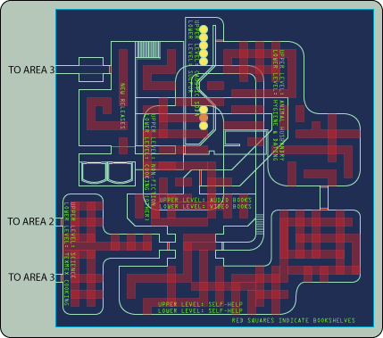
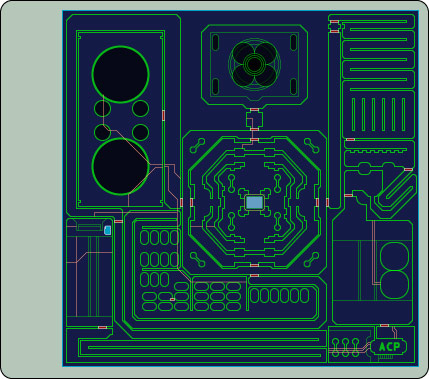

Title: Welcome to the DynaMars Corporation's Ares Station Update Service
Date: 2007-10-16T0:00:00.00
Modified: 2007-10-16T0:00:00.00
Section: dynamars
Slug: dynamars-update-008
Authors: DynaMars Corporation Information Kiosk
Summary: Keep up to date on the DynaMars Corporation's perpetually doomed efforts to colonize Mars.

%%%

# Station News

Welcome to the Ares Station Update Service. This appears to be your first visit to an information kiosk. Previous updates are available in archived format!

This kiosk is designed to keep you up-to-date on the latest developments pertinent to residents of the DynaMars Corporation's Ares Station, the premiere living and research colony on Mars.

Please read each update in full.

**04-07-2304 - New Entry**

Good news, residents!

Ares Station Commanding Officer Paskiewicz has returned from his vacation on Io, where he enjoyed six days of being pampered by the beautiful male care attendants manning the volcanic moon's most luxurious resort, the Tvashtar Grand.
The DynaMars Corporation regrets that it forgot to inform all Ares Station Residents that its commanding officer would be going on vacation and that it forgot to appoint a deputy in his stead.

Due to the large amount of damage incurred by residents in the past six days, the DynaMars Corporation is exercising its right to cut all salaries by 20%. The DynaMars Corporation wishes to apologize to all Ares Station residents for the unfortunate interruption in leadership, but reiterates that such events do not warrant the abuse or murder of valuable equipment, such as intercoms, computers, personnel, barrels, or valuable scientific specimens.

An emergency shipment of Shasta Cola has also arrived. Beverage supplies should now be fully adequate for the next three weeks, negating the need for any further disobedience. The DynaMars Corporation has also facilitated the delivery of 45 additional residents to help make up for the recent wave of mass murders, riots, suicides, and disappearances.

A new day is dawning on Mars! Look up and smile!

**04-08-2304 - New Entry**

DynaMars CEO Davies has arrived and is looking forward to auditing all personnel in hopes of establishing a timeline of events and comprehensive list of conduct violations and criminal actions committed immediately before and during the disastrous Interstellar Scrabble Tournament. The DynaMars Corporation wishes to remind you that CEO Davies has been verified as being fully human, and should be treated as such.

Having learned his lesson, Chief Security Officer Mackey was released from the closet he was imprisoned in after his violent uprising. He has been ordered by the DynaMars Corporation to write apology e-mails to the families and friends of his victims.

In the event that one of your friends or family members died at the hands of Chief Security Officer Mackey during his reign of terror, the DynaMars Corporation would like you to accept his apology by no later than 04-10-2304 to ensure minimal work interruptions and a friendly, synergistic environment.

**04-09-2304 - New Entry**

Chief Crate Inspector Peterson reports that crate \#4728-231A shows signs of tampering due to a broken seal and missing contents. Because an EMP was detonated when he was entering the data into his computer, he is unable to find any records pertaining to the nature of \#4728-231A's contents.

\#4728-231A is due to be shipped to Europa on 04-14-2304. If the contents are returned within one day, no questions will be asked and no effort will be made by any station personnel or the DynaMars Corporation to prosecute. The DynaMars Corporation would like to remind all residents that doing the right thing benefits everyone. We're all one big Martian Family here!

**04-10-2304 - New Entry**

The DynaMars Corporation would like to remind all residents that leaving audio diaries lying around is dangerous and against company protocol. This is especially true of audio diaries containing proprietary information and security codes. If one of your audio diaries is found, you will be subject to severe disciplinary actions. If you find an audio diary that does not belong to you, DO NOT LISTEN TO IT. In addition to trade secrets, it may contain someone's innermost thoughts, secrets, and ambitions. Deliver it to Ares Station Area 5 Lost and Found at once!

Ares Station Resident \#277 was found mauled to death in Area 2 Atmospheric Processing. If you or someone you know fatally mauled \#277, the DynaMars Corporation requests that you please come forward immediately.

Funeral services for \#277 will be held tomorrow at 0800 hours, after which he will be ceremoniously croutonized in keeping with his religious traditions.

**04-11-2304 - New Entry**

Attention all Ares Station Residents: A strange bug is loose on the station and no one is safe!

It is known by researchers as the "Acting Bug" and is extremely contagious. If it has bitten you, please report to the Area 3 Library at 1900 on 04-13-2304 where auditions for Hamlet will be taking place. Kick back and have a little fun! You've earned it, citizen!

The DynaMars Corporation is pleased to announce that E.M. Arbuckle will be staging a book signing in the Area 3 Library Non-Fiction Section. Arbuckle, author of the new book Sins of Our Solar Republic, is looking forward to signing his name on your copy and answering any questions you might have about our Solar Republic and its sins. Be sure to visit the Area 3 Library Non-Fiction Section on 04-19-2304. Arbuckle will be standing by all day to accommodate as many personnel as possible.

Due to complaints that the library is difficult to navigate, please refer to this map:

In order to access the non-fiction section, you may need to acquire the blue keycard from Chief Librarian Hendren, who was last seen in the Auxiliary Waste Processing Center some 2,000 feet below the Area 7 Biosphere, where he was observed screaming profanities at shadows. Here is a map of the Auxiliary Waste Processing Center, with the presumed location of Chief Librarian Hendren.

**04-12-2304 - New Entry**

Attention all Ares Station Residents: A strange bug is loose on the station and no one is safe!

Chief Science Officer Thorpe has identified the insects as "deathmites," a virulent insect known to burrow under the skin and deposit millions of microscopic eggs in the lungs, which are then spread to others through the air by way of coughing. If you find yourself fatigued, stressed, coughing, bleeding profusely from every orifice, or choking, please report to Quantum Labs immediately.

**04-13-2304 - New Entry**

The DynaMars Corporation regrets to inform all residents that the planned production of Hamlet has been cancelled due to an unexpected series of killings. Chief Security Officer Mackey reports that a large polar bear somehow found its way into the Area 3 Library, where it used the scheduled Hamlet auditions as an excuse to maul and maim as many humans is it could before it was shoed away by a Mobile Defense Sentry Unit.

The DynaMars Corporation reminds all residents that these things happen, and that there will be future plays to look forward to. In the meantime, please be vigilant and remain attentive to all duties.

Good News! Chief Science Officer Thorpe admitted that there is no deathmite infestation in Ares Station! Chief Science Officer Thorpe and his fellow scientists, lonely and seeking human contact, falsely reported the outbreak in order to get more visitors. The DynaMars Corporation wishes to apologize to all residents. As a result of this prank, Quantum Labs will have its funding cut by 30%.

The DynaMars Corporation wishes to inform all parties searching for Chief Librarian Hendren that the Auxiliary Waste Processing Center's Atmospheric Control Processor is malfunctioning. As a result, the atmosphere in the Auxiliary Waste Processing Center is extremely toxic. A replacement unit can be found in the Area 1 Cargo Bay in Shipping Crate \#4728-231C.

**04-14-2304 - New Entry**

We regret to inform you that Shipping Crate \#4728-231C contained a live polar bear. The DynaMars Corporation wishes to apologize to all those killed by the ravenous bear. The correct crate number is \#4728-231B.
The DynaMars Corporation would also like to alert all residents that as many as two polar bears may be loose on the station. Having been awoken prematurely from cryosleep, both are hungry, angry, and very likely resentful of human beings. If you see one you are hereby ordered to subdue it immediately using only non-lethal force.

**04-15-2304 - New Entry**

The DynaMars Corporation regrets to inform all residents that CEO Davies has disappeared. After missing several scheduled conference calls and audits, a station-wide search was initiated. The DynaMars Corporation is insisting that all Ares Station residents do their part in help find CEO Davies so that he can continue with his audits and criminal investigation.

**04-16-2304 - New Entry**

An audio diary belonging to CEO Davies was found near the entrance to the ancient caves. It is currently undergoing analysis by the DynaMars Corporation's Board of Directors, and will hopefully lead to the quick recovery of CEO Davies.

Good News! The Area 7 Biosphere Reflecting Pond has been reopened! If you are one of the crewmembers sealed in the Area 7 Biosphere, please feel free to make use of it for all your reflecting needs! The DynaMars Corporation wishes to offer its sincere congratulations to Chief Landscaping Officer Wilson for his fine work getting the Area 7 Biosphere back to working order.

**04-17-2304 - New Entry**

Chief Security Officer Mackey and Chief Archeologist Bailey conducted a survey of the ancient caves, but did not recover CEO Davies. They did find several aged casks of scotch, various animal skeletons, and more audio diaries belonging to CEO Davies. The DynaMars Corporation is currently analyzing the audio diaries for further intelligence.

**04-18-2304 - New Entry**

Congratulations to the team that successfully recovered the blue keycard necessary to access the Area 3 Library Non-Fiction Section. Although they lost five men recovering the keycard, they persevered like true fans of literature! They even recovered Chief Librarian Hendren, so mad and insane from toxic fumes that he has taken to eating his own hair and feces. Good job, team!

However, the DynaMars Corporation regrets to inform residents that E.M. Arbuckle was killed when his ship crashed into Phobos. The book signing is therefore cancelled.

**04-19-2304 - New Entry**

Area 3 is now completely offline due to gross misconduct on the part of Chief Particle Transducer Catalyst Technician Boruff. Chief Particle Transducer Catalyst Technician Boruff exceeded his authority and attempted to use Level 3 Baconization Protocols on bacon. The result created a paradox that rippled throughout the whole of Area 3, creating massive shockwaves, explosions, decompressions, and anomalies unexplainable by current science.

Chief Particle Transducer Catalyst Technician Boruff, who now paradoxically exists as both man and man-shaped lump of bacon simultaneously, has been terminated from his position and is being re-assigned as Chief Shipyard Officer.

**04-20-2304 - New Entry**

Good news! Commanding Officer Paskiewicz has come up with a plan to catch the missing polar bears. At 2100 hours, oxygen levels will drop to 50% and the temperature will decrease to 28 degrees. This should, in theory, cause the bears to begin hibernating, making them extremely easy to cram back into crates.

Residents are advised to bundle up and breathe sparingly!

**04-21-2304 - New Entry**

The DynaMars Corporation wishes to apologize to all Ares Station Residents for agreeing with Commanding Officer Paskiewicz's plan. While it sounded good in theory, it succeeded only in giving the bears a home court advantage. As a result, they easily mauled and killed some 42 crewmembers, weak, tired, cold, and barely coherent enough to understand what was happening to them.

Due to the disaster in Area 3, the fallen crewmembers will not be baconized and instead will be cremated.

The good news is that the bears, well fed and satisfied, returned to their storage crates to begin hibernation. They will be shipped to Europa promptly.

The DynaMars Corporation is pleased to announce oxygen levels and temperature will be returning to normal. In honor of these dearly departed Ares Station family members, Shasta Cola rations have been increased and all residents are invited to enjoy a memorial meal in the Area 6 Auxiliary Dining Hall, currently overseen by the newly reassigned Chief Chef Hendren.

Following review of his last recovered audio diary, the DynaMars Corporation is now calling off the search for CEO Davies. As to what strange presence called out to him and led him deeper and deeper into the black heart of Mars itself, we are not at liberty to reveal due to our policy against sharing other people's innermost secrets and desires.

The DynaMars Corporation is therefore concluding all Ares Station employee audits. We hope this gesture of goodwill and the great many recent successes will inspire residents to continue working hard to make Ares Station the finest colony on Mars! The future of the Red Planet is in your hands, brave citizens! The DynaMars Corporation salutes you!